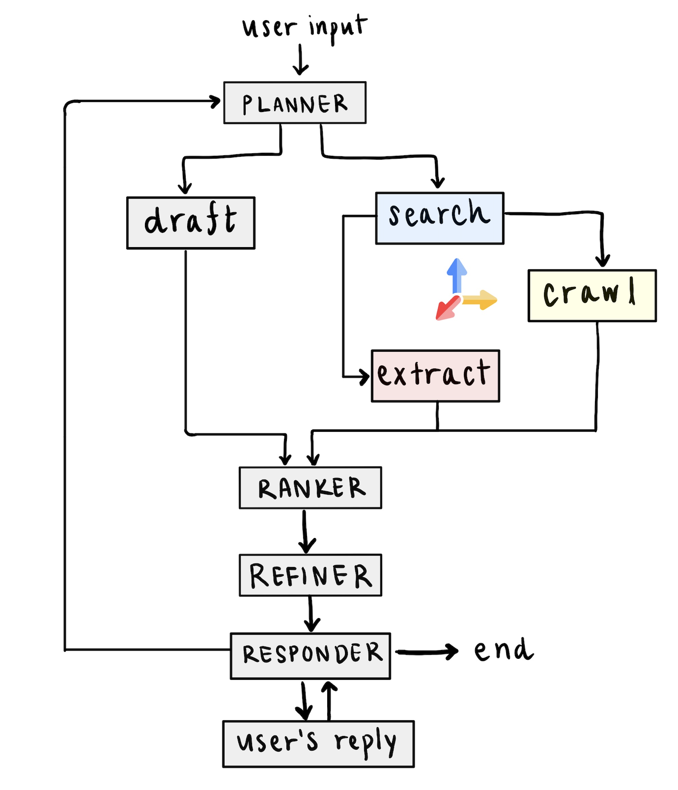

## Tavily Real Time RAG

**Motivation**  
Large language models are great at producing text when the answer lies somewhere in their training data or is easily found online. The moment we need something new, niche, or buried deep in the web, they tend to fail.

Traditional **Retrieval-Augmented Generation (RAG)** solves this by loading up a datastore of pre-indexed content, but that only works if we already collected the relevant data to any query the user might ask.

**Real Time RAG**
This implementation creates a live **search-and-crawl pipeline** for each query. With Tavily’s Search and Crawl APIs, dozens or even hundreds of fresh files are pulled in under a minute, and provide relevent context to the llm to refine its answers.
This setup aims to achive: 

* a richer, more accurate answer  
* clickable source links so the user can dig deeper  

The included example is a **coding dynamic RAG**: given a problem, it finds relevant GitHub files, learns from them, and refines its solution. A main goal for this repo is to be easily adaptable to any other domain.

---

## Project Overview  

the workflow is implemented using LangGraph; each node owns a single job:

| Node      | What it does                                                             |
|-----------|--------------------------------------------------------------------------|
| Planner   | LLM drafts an outline and up-to-3 Tavily search queries                  |
| Drafter   | First code attempt                                                       |
| Search    | Tavily Search, collects candidate URLs                                   |
| Crawler   | Tavily Crawl, based on candidate, collects neighboring URLS and their raw content               |
| Extract   | Converts GitHub `/blob/` to `/raw/` to extracts raw code content |
| Ranker    | Embeds draft and files, then computes cosine similarity                  |
| Refiner   | Rewrites draft using the most relevant files as examples                 |
| Responder | Displays the result, collects user feedback, and decides whether to run another cycle or finish |



**Note**
* **Extract** is the only domain-specific node (GitHub). Swap it out for another spesific downloader or skip it entirely since in most cases the crawl already returns the relavent raw text.

---

## Future Improvments

* **Prompts** – All prompts for the LLMs are in `llm_configs.py`. Tuning them (or switching models) has the biggest impact. Improtant to keep the JSON output formats intact.  
* **Embeddings & Chunking** – Right now the embedding is one 8 k-char slice per file. For lbetter results: chunk + overlap + rank chunks. A local model like CodeBERT or other spesific embeders would be ideal, but on a local run on my (old) MacBook it was too slow.  
* **Crawl parameters** – Current params are (`max_depth=3`, `max_breadth=100`, `limit=500`) are a compromise between speed and coverage for GitHub. Different domains will want different params.
* **Multi-loop interaction** – The workflow already supports iterative refinement: after each answer, the user can ask follow-up questions and trigger another cycle. Currently, we only carry over the latest user prompt and the responder’s message. A next step would be to persist a compact history (e.g., outline snapshots, top sources, or key code diffs) so each loop has richer context without bloating the prompt.

---

## Repository structure

```text
tavily_real_time_rag/
├── backend/
│   ├── __init__.py
│   ├── base_node.py
│   ├── llm_configs.py
│   ├── main.py
│   ├── state.py
│   ├── utils.py
│   ├── logs/
│   │   └── backend.log
│   └── nodes/
│       ├── __init__.py
│       ├── planner.py
│       ├── drafter.py
│       ├── search.py
│       ├── crawl.py
│       ├── extract.py
│       ├── ranker.py
│       ├── refiner.py
│       ├── filter.py
│       └── responder.py
├── results/
│   ├── rna_folding_demo.mp4
│   ├── rna_folding.log
│   ├── tavily_research_agent.log
├── graph_diagram.png
├── requirements.txt
└── README.md
```
---

## Quick start

1. **Clone the repository and set up a venv**
   
   ```bash
   git clone https://github.com/your-name/tavily-in-the-loop.git
    ```
2. **Install dependencies**

   ```bash
   pip install -r requirements.txt
   ```

3. **Add API keys**

```bash
# create a .env file at the project root:
TAVILY_API_KEY=your_tavily_api_key
OPENAI_API_KEY=your_openai_api_key
```


